# GASA-ERP — Documentation Fonctionnelle et Technique

> Système de gestion intégré pour établissements d'enseignement supérieur.
> Contrôle d'accès par badge RFID/QR Code, suivi d'assiduité en temps réel, gestion pédagogique et emplois du temps.

---

## 1. Rôles et Périmètres d'Action

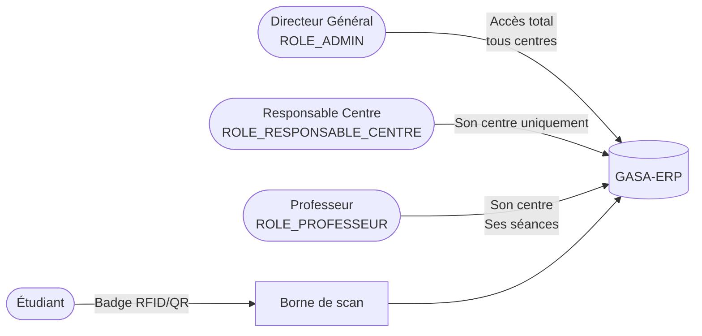

| Rôle | Peut créer | Peut modifier | Restriction |
|:---|:---|:---|:---|
| Directeur (Admin) | Tout | Tout | Aucune |
| Responsable | Groupes, séances, étudiants | Son centre | Un seul centre |
| Professeur | — | Clôture de ses séances | Ses séances uniquement |
| Étudiant | — | — | Scan badge uniquement |

---

## 2. Modèle de Données (Entités principales)

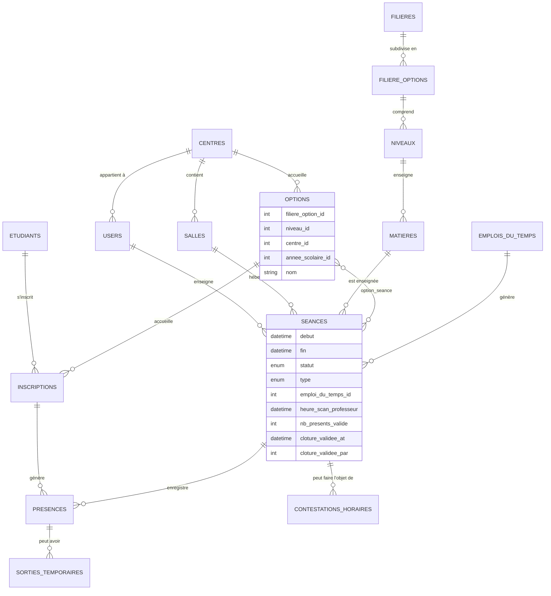

---

## 3. Cycle de Vie d'une Séance

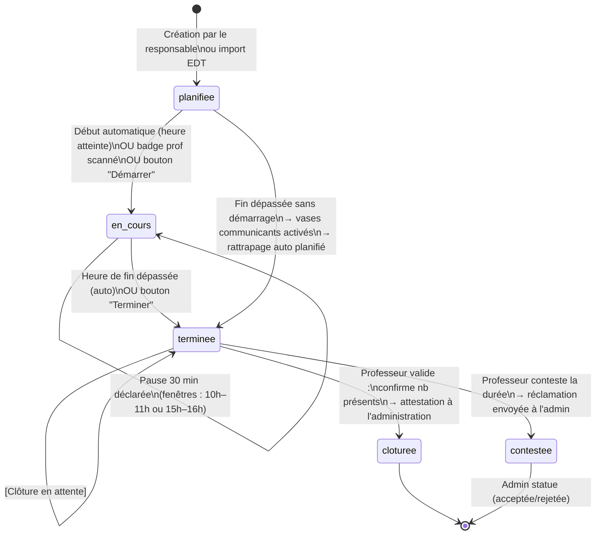

> **Règle de clôture :** Seul le **professeur de la séance** (ou le Directeur) peut valider la clôture. Le responsable de centre n'a pas ce droit. La clôture est l'attestation du professeur envers l'administration que la séance a bien eu lieu avec N présents.

---

## 4. Flux de Scan RFID/QR Code

### 4.1 Identification du porteur de badge

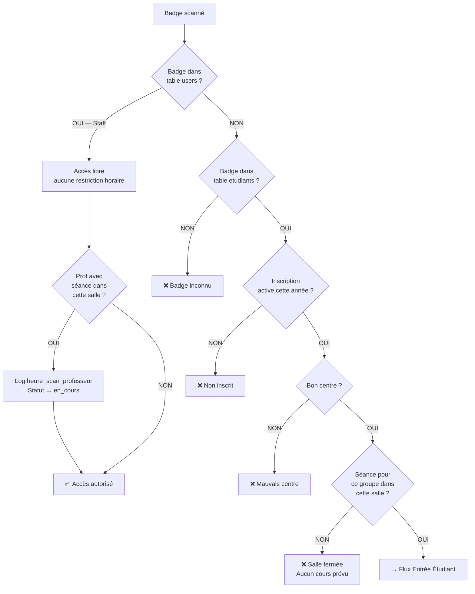

### 4.2 Entrée étudiant (mode entrée)

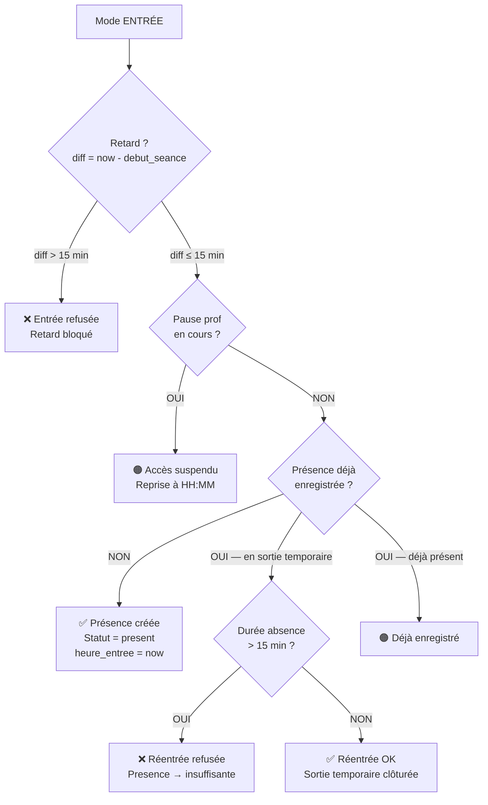

### 4.3 Sortie étudiant (mode sortie)

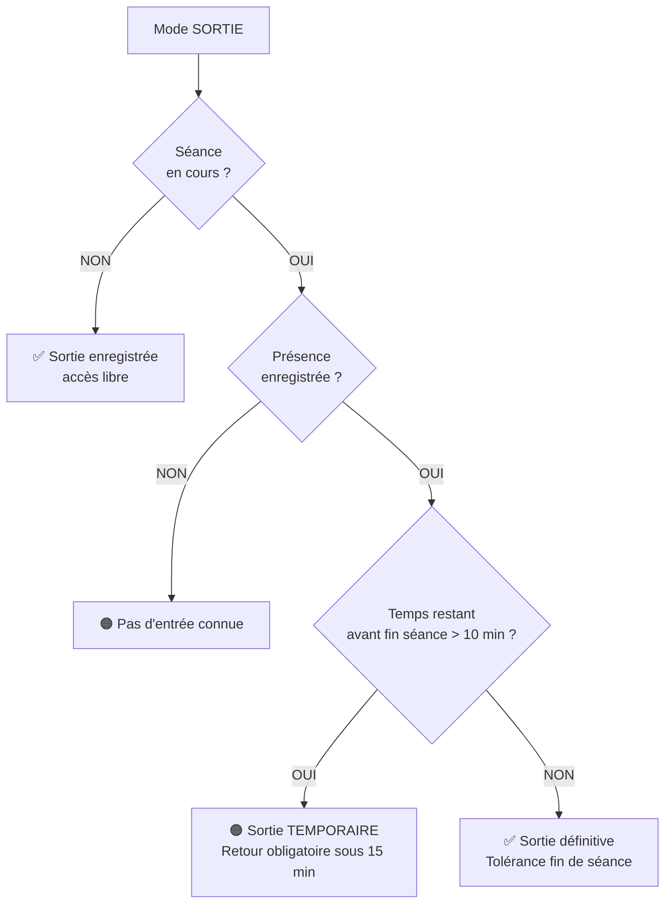

---

## 5. Règles de Gestion Métier

### RG-01 — Accès à une salle (étudiant)

| Condition | Résultat |
|:---|:---|
| Badge inconnu | ❌ Refusé — badge_inconnu |
| Pas d'inscription active | ❌ Refusé — non_inscrit |
| Étudiant d'un autre centre | ❌ Refusé — mauvais_centre |
| Aucune séance pour son groupe dans la salle | ❌ Refusé — aucun_cours |
| Séance trouvée mais retard > 15 min | ❌ Refusé — retard_bloqué |
| Séance en pause prof | 🟠 Suspendu — pause_prof |
| Séance trouvée, dans les temps | ✅ Autorisé |

**Fenêtre d'accès anticipé :** L'étudiant peut entrer jusqu'à **1 heure avant** le début de la séance (si statut = `planifiee` et dans l'heure à venir).

### RG-02 — Accès staff (professeur, responsable, admin)

- Accès libre à toute salle, à tout moment, sans restriction horaire.
- Si le badge correspond au professeur affecté à une séance dans la salle scannée : le champ `heure_scan_professeur` est automatiquement renseigné et la séance passe en `en_cours`.

### RG-03 — Sortie temporaire étudiant

- Autorisée **une seule fois** par séance par étudiant.
- L'étudiant a **15 minutes** pour revenir.
- Si > 15 min : réentrée refusée, présence marquée `presence_insuffisante`.
- La sortie définitive (fin de cours) est tolérée si la séance se termine dans ≤ 10 min.

### RG-04 — Pause professeur

```
Conditions d'autorisation :
  ✓ Séance en statut en_cours
  ✓ Heure actuelle dans 10h00–11h00 OU 15h00–16h00
  ✗ Séances du soir (début ≥ 17h30) → aucune pause
  ✗ Groupes Master (M1, M2, Master) → aucune pause
  Durée fixe : 30 minutes
```

Pendant une pause, tout scan d'étudiant en entrée retourne le statut `pause_prof` (🟠 orange).

### RG-05 — HP avant TPE

Lors de la planification, une séance de type **TPE** ne peut être créée que si le volume total de séances HP (terminées + planifiées) couvre **100%** du quota `hp_initial` de la matière.

```
HPcouvert = Σ durées(HP terminées) + Σ durées(HP planifiées)
Si HPcouvert < hp_initial → erreur bloquante, TPE refusé
```

### RG-06 — Vases Communicants (HP manqué)

Déclenchement : séance HP terminée **sans** scan professeur (prof absent) ET pas une composition.

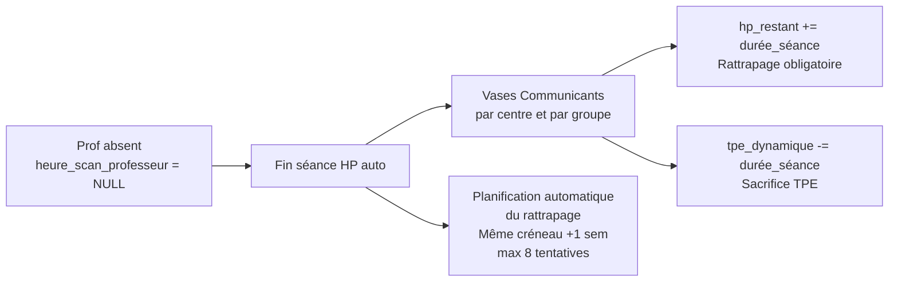

- La matière ne peut être déclarée terminée que si `hp_restant = 0` ET `tpe_dynamique = 0`.
- Si aucun créneau libre dans les 8 prochaines semaines : les heures restent visibles dans le suivi des quotas.

### RG-07 — Absents automatiques

Lors de la clôture d'une séance (`terminee`), tous les étudiants inscrits dans les groupes rattachés à la séance qui n'ont pas de présence enregistrée reçoivent automatiquement le statut `absent`.

### RG-08 — Clôture de séance (cahier de texte numérique)

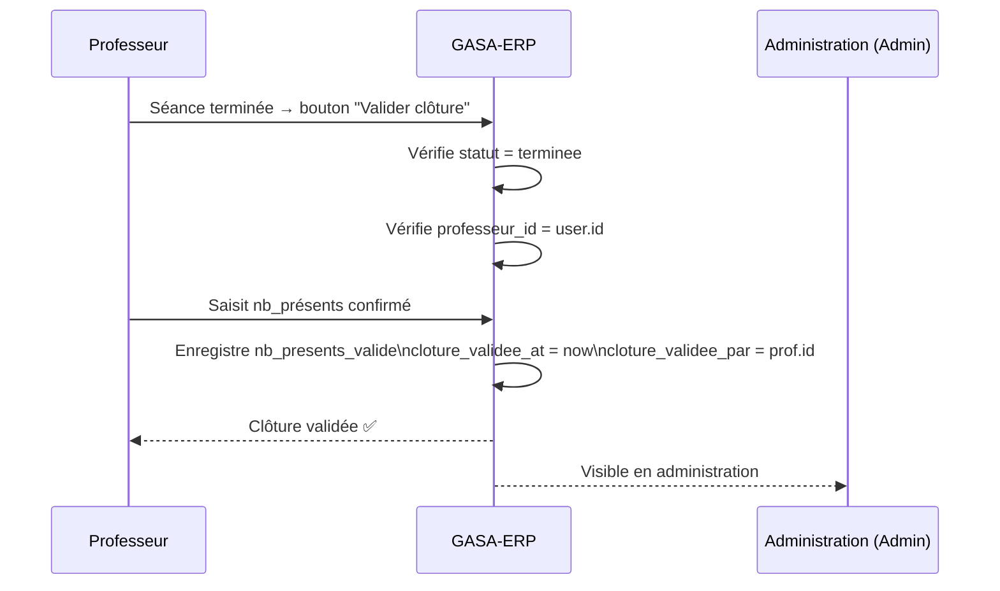

> ⚠️ **Règle critique :** Le **responsable de centre ne peut pas valider la clôture**. Seul le professeur de la séance (ou le Directeur Général) peut attester la réalité du cours auprès de l'administration.

### RG-09 — Contestation horaire

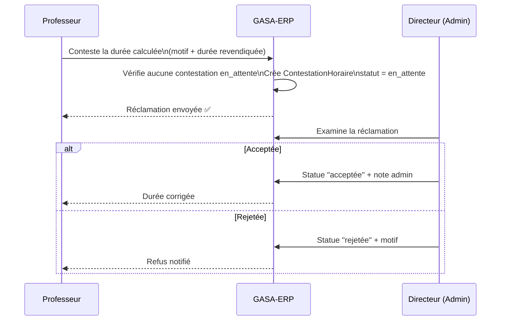

Conditions : séance en statut `terminee`, pas de contestation `en_attente` déjà ouverte.

### RG-10 — Contrôle de capacité

Lors de la création d'une séance, le total des étudiants actifs de tous les groupes rattachés est comparé à la capacité de la salle :

```
total_inscrits = Σ inscriptions_actives(option_ids)
Si total_inscrits > salle.capacite → erreur bloquante
```

### RG-11 — Conflit de salle

Une salle ne peut accueillir qu'une seule séance à la fois. La vérification porte sur les séances `planifiee` ou `en_cours`. Le chevauchement est détecté par comparaison des plages `[debut, fin]`.

### RG-12 — Synchronisation automatique des statuts

À chaque chargement de la page Planning, le système synchronise automatiquement les statuts :

```
planifiee → en_cours  : si debut ≤ now < fin
planifiee/en_cours → terminee : si fin ≤ now
                                → vases communicants si prof absent
                                → absents automatiques
```

---

## 6. Emploi du Temps — Import et Grille

### 6.1 Flux d'import

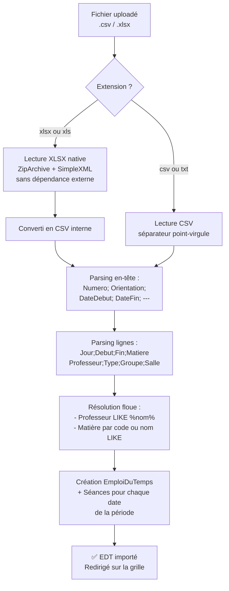

### 6.2 Grille d'affichage

La grille reproduit le format matriciel des emplois du temps papier de l'établissement :

- Axe vertical : **12 tranches horaires** de 07h30 à 18h00
- Axe horizontal : **LUNDI à SAMEDI**
- Lignes spéciales `RÉCRÉATION` à 10h–10h30 et 12h–13h
- Algorithme **rowspan** : un cours de 3h occupe visuellement 3 lignes (même si récréation au milieu)

### 6.3 Format CSV attendu

```
# En-tête (clé;valeur)
Numero;1
Orientation;GE2 (SIL2)
DateDebut;23/06/2026
DateFin;04/07/2026
---
Jour;Debut;Fin;Matiere;Professeur;Type;Groupe;Salle
LUNDI;07:30;08:00;TP-RM;DEGBOE;HP;GE-SI L1;Salle 101
LUNDI;08:00;11:00;ALGO;AKPONNA;HP;;
MARDI;13:00;16:00;BDD;MONTCHO;HP;GE-SIL L1;Labo Info A
```

Règles de résolution à l'import :
- **Professeur** : recherche `LIKE '%nom%'` dans les users du centre avec rôle ROLE_PROFESSEUR
- **Matière** : code exact (insensible à la casse) OU nom `LIKE '%code%'`
- **Salle** : nom `LIKE '%nom%'` dans le centre, sinon salle par défaut du formulaire
- **Groupe** : nom ou code `LIKE` dans les options du centre, sinon option choisie dans le formulaire

---

## 7. Flux Pédagogique Complet

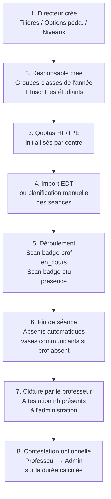

---

## 8. Statuts de Présence

| Statut | Signification |
|:---|:---|
| `present` | Entré à temps, sorti correctement ou toujours en salle |
| `absent` | Aucune entrée enregistrée (mis automatiquement à la clôture) |
| `retard` | Entré mais après la tolérance (calculé selon heure_entree) |
| `presence_insuffisante` | Réentrée refusée après sortie temporaire > 15 min |
| `sortie_anticipee_toleree` | Sorti dans les 10 dernières minutes de cours |

---

## 9. Base de Données — Tables et Champs Clés

### Tables de référentiel

| Table | Rôle |
|:---|:---|
| `annees_scolaires` | Années académiques ; une seule `active = true` à la fois |
| `centres` | Sites physiques (Gbégamey, Akpakpa, Porto-Novo, Calavi) |
| `filieres` | Domaines (ex: Génie Électrique) |
| `filiere_options` | Spécialités (ex: SIL, RIT) |
| `niveaux` | Paliers (L1, L2, M1…) |
| `matieres` | Unités d'enseignement avec quota `hp_initial` et `tpe_initial` |

### Tables opérationnelles

| Table | Rôle |
|:---|:---|
| `users` | Staff : admin, responsables, professeurs — champ `badge_uid` pour le scan |
| `options` | Groupes-classes liés à une année, un centre, une spécialité |
| `etudiants` | Profils permanents — champ `badge_uid` pour le scan |
| `inscriptions` | Lien Étudiant ↔ Groupe, avec statut (`actif`, `redoublant`…) |
| `salles` | Salles physiques avec `type` et `capacite` |
| `equipements` | Inventaire des équipements par salle |
| `seances` | Cours : `debut`, `fin`, `type` (HP/TPE), `statut`, `emploi_du_temps_id` |
| `emplois_du_temps` | Périodes d'EDT importées (numero, orientation, date_debut, date_fin) |

### Tables de suivi

| Table | Rôle |
|:---|:---|
| `presences` | `heure_entree`, `heure_sortie_definitive`, `statut` par étudiant et séance |
| `sorties_temporaires` | Pauses étudiants : `heure_sortie`, `heure_rentree`, `rentree_refusee` |
| `matiere_centre_annee` | Quotas HP/TPE restants par matière, centre et année |
| `option_seance` | Pivot : une séance peut concerner plusieurs groupes |
| `matiere_professeur` | Habilitations : quel professeur enseigne quelle matière |
| `contestations_horaires` | Réclamations de durée prof → admin, statut `en_attente/acceptee/rejetee` |

---

## 10. Points d'Attention et Contraintes

| Contrainte | Détail |
|:---|:---|
| Badge RFID/QR | Deux tables distinctes : `users.badge_uid` (staff) et `etudiants.badge_uid` (étudiants). Priorité au staff lors d'un scan. |
| Import XLSX natif | Implémenté via `ZipArchive` + `SimpleXML`. Aucun package externe requis (pas de phpspreadsheet). |
| Séparateur CSV | Point-virgule `;` obligatoire. |
| Retard bloqué | Strictement > 15 min après le début de la séance. |
| Clôture | Professeur uniquement (pas le responsable de centre). |
| Rattrapage auto | Cherche le même créneau +1 semaine, jusqu'à +8 semaines. Échec silencieux : les heures restent dans le quota. |
| Compositions | Séances `est_composition = true` : les vases communicants ne s'appliquent pas si le prof est absent. |
