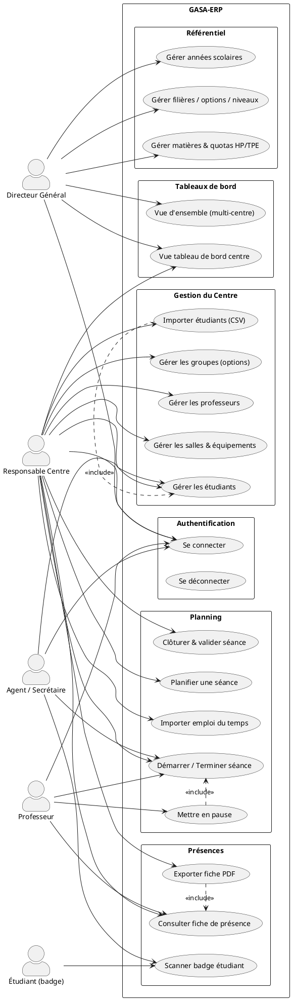
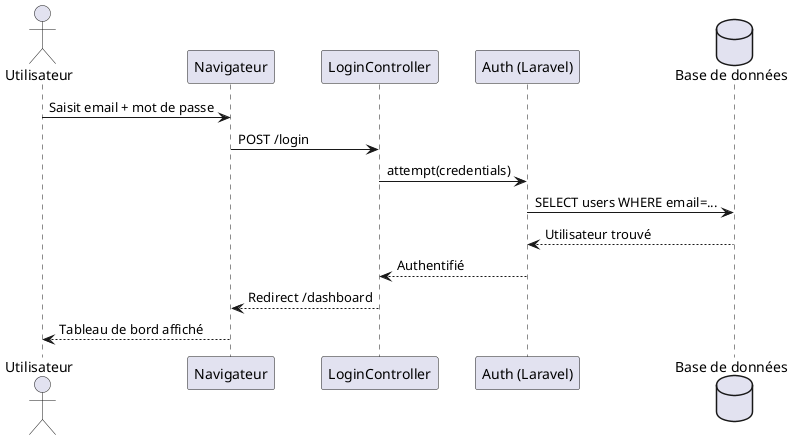
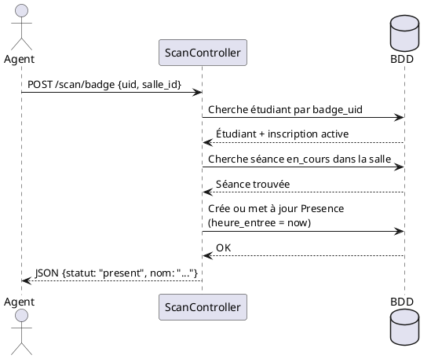
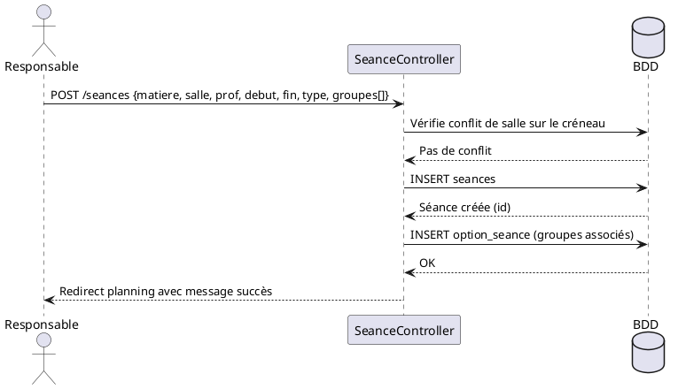
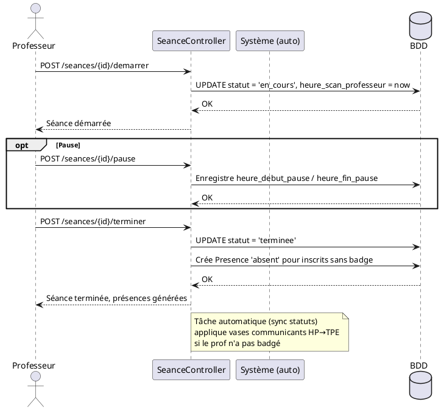
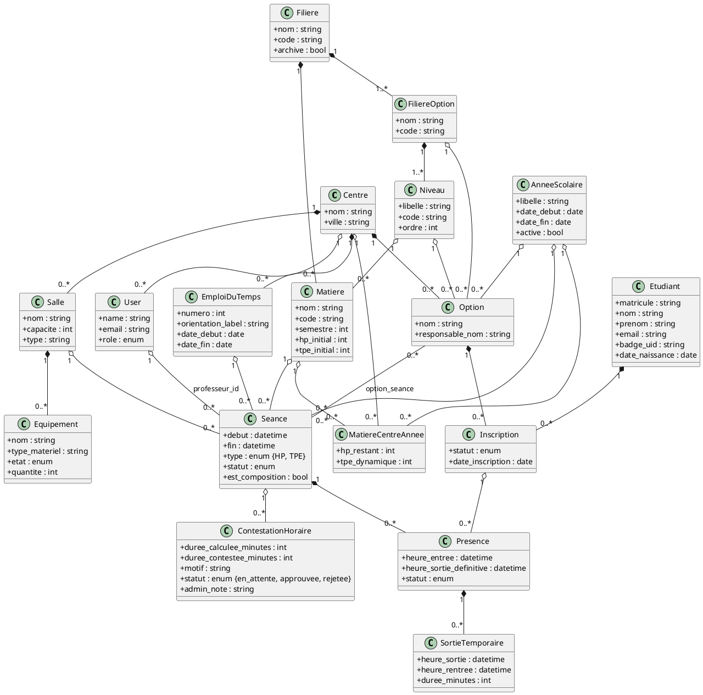
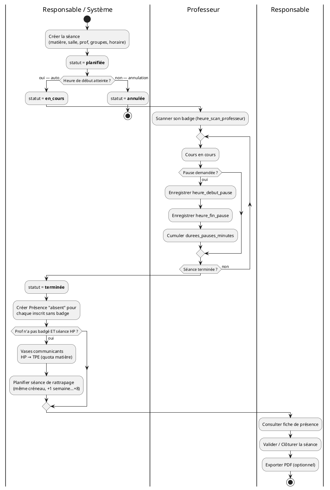

# GASA-ERP — Diagrammes UML

> Rendu avec l'extension **PlantUML** (VS Code) ou sur [plantuml.com/plantuml](https://www.plantuml.com/plantuml).

---

## 1. Diagramme de cas d'utilisation

---

## 2. Diagrammes de séquence

### 2.1 Connexion au système

---

### 2.2 Scan de badge étudiant

---

### 2.3 Planification d'une séance

---

### 2.4 Déroulement et clôture d'une séance

---

## 3. Diagramme de classes

---

## 4. Diagramme d'activité — Cycle de vie d'une séance

